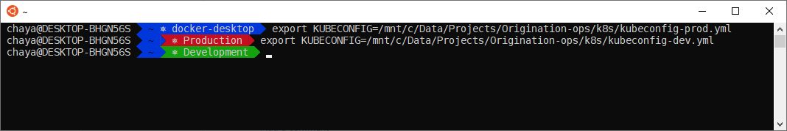

# zsh-k8s-context

Add kubernetes context to agnoster zsh theme, edit your agnoster theme file:

    vim ~/.oh-my-zsh/themes/agnoster.zsh-theme
    
Add this function at the end of the file, before 'build_prompt', you can change condition to match your different environment with different colors

    #K8S env
    prompt_k8s() {
      (( $+commands[kubectl] )) || return
    
      local K8S_CONTEXT=$(kubectl config current-context)
      local BACKGROUND=blue
      local FOREGROUND=white
      if [[ "$K8S_CONTEXT" == *"@"* ]]; then
        K8S_CONTEXT=$(echo $K8S_CONTEXT | grep -o '@.*' | cut -f2- -d@)
      fi
      local K8S_CONTEXT_LOWER=$(echo "$K8S_CONTEXT" | tr '[:upper:]' '[:lower:]')
    
      if [[ "$K8S_CONTEXT_LOWER" == *"prod"* ]]; then
        BACKGROUND=red
        FOREGROUND=white
      elif [[ "$K8S_CONTEXT_LOWER" == *"dev"* ]]; then
        BACKGROUND=green
        FOREGROUND=white
      fi
      prompt_segment $BACKGROUND $FOREGROUND "\u2388 $K8S_CONTEXT"
    }
Update 'build_prompt' function with your 'prompt_k8s' function

    ## Main prompt
    build_prompt() {
      RETVAL=$?
      prompt_status
      ...
      prompt_k8s
      ...
      prompt_end
    }
